# Procesverslag
Markdown is een simpele manier om HTML te schrijven.  
Markdown cheat cheet: [Hulp bij het schrijven van Markdown](https://github.com/adam-p/markdown-here/wiki/Markdown-Cheatsheet).

Nb. De standaardstructuur en de spartaanse opmaak van de README.md zijn helemaal prima. Het gaat om de inhoud van je procesverslag. Besteedt de tijd voor pracht en praal aan je website.

Nb. Door *open* toe te voegen aan een *details* element kun je deze standaard open zetten. Fijn om dat steeds voor de relevante stuk(ken) te doen.

## Jij

  
uitwerken voor kick-off werkgroep

  ### Auteur:
  Joy Amo

  #### Je startniveau:
  Blauw

  #### Je focus:
  Surface plane

  -Aria label
  -Animatie
  -Video
  -Prefers reduced motion
  -Scroll snap ?
  -Micro interactie
 

## Je website

  
uitwerken voor kick-off werkgroep

  ### Je opdracht:
  link naar de website die je gaat namaken óf de naam/omschrijving van je eigen ontwerp
  https://global.shop.smtown.com/ 

  #### Screenshot(s) van de eerste pagina (small screen): 
  hier de naam van de pagina  
  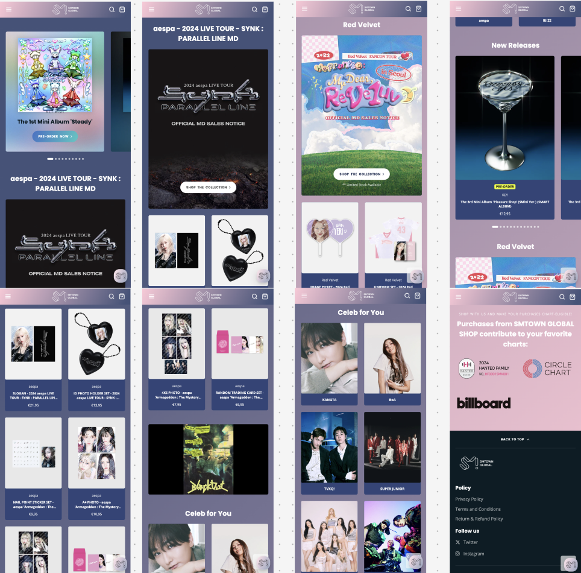

  #### Screenshot(s) van de tweede pagina (small screen):
  hier de naam van de pagina  
  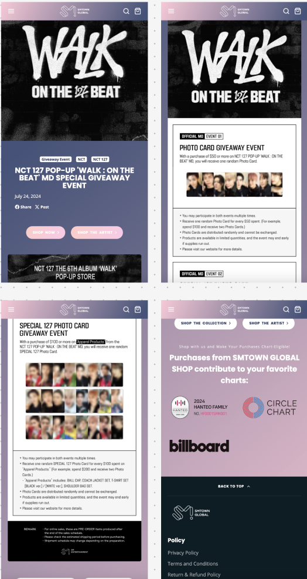
 

## Toegankelijkheidstest 1/2 (week 1)

  
uitwerken na test in 2e werkgroep

  ### Bevindingen
  Lijst met je bevindingen die in de test naar voren kwamen:
   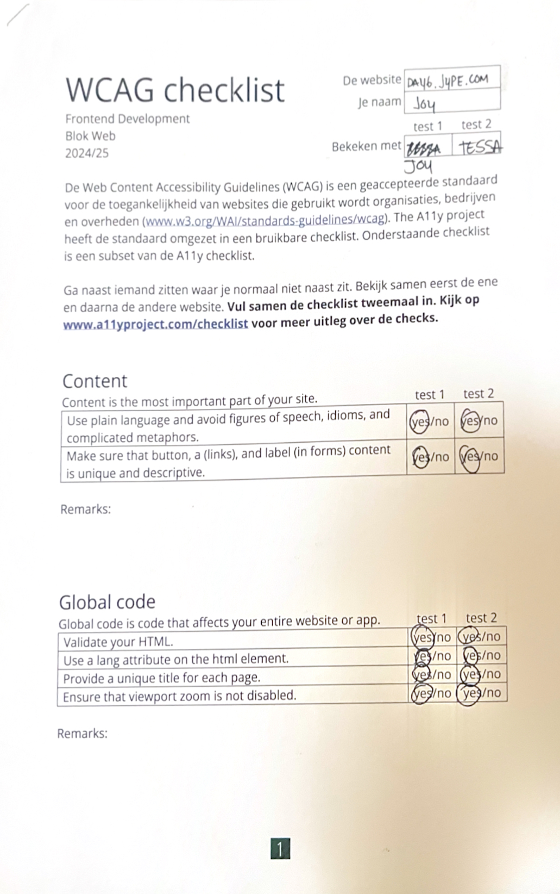
   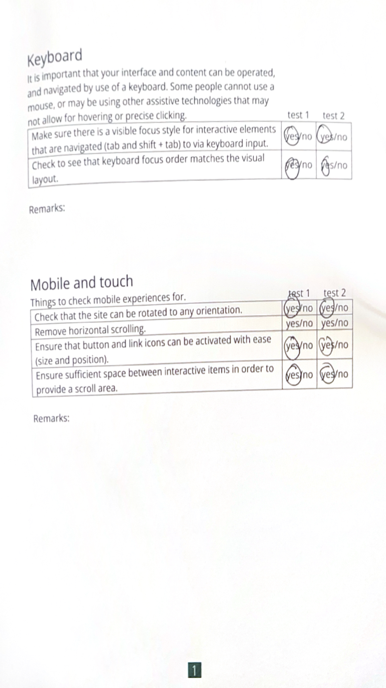
   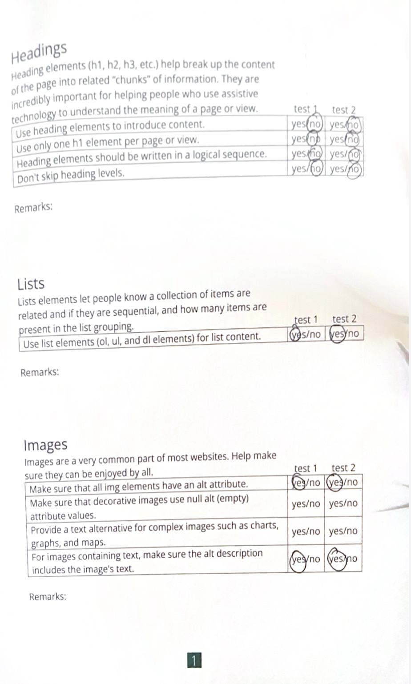
   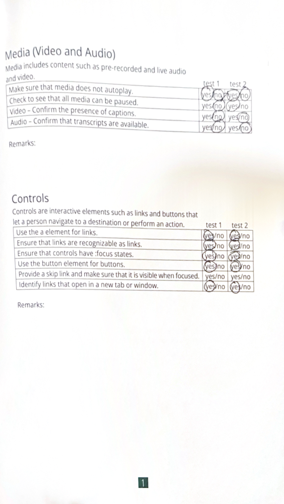
   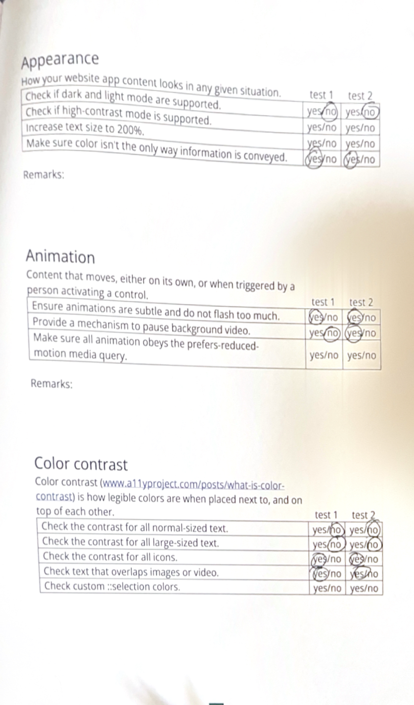

   In deze toegankelijkheidstest zijn Tessa en ik door de wcag checklist heen gegaan. We zijn tegelijk door onze gekozen websites heen gegaan en zo de yes or no vragen door heen gegaan. 

## Breakdownschets (week 1)

  
uitwerken na afloop 3e werkgroep

  ### de hele pagina: 
  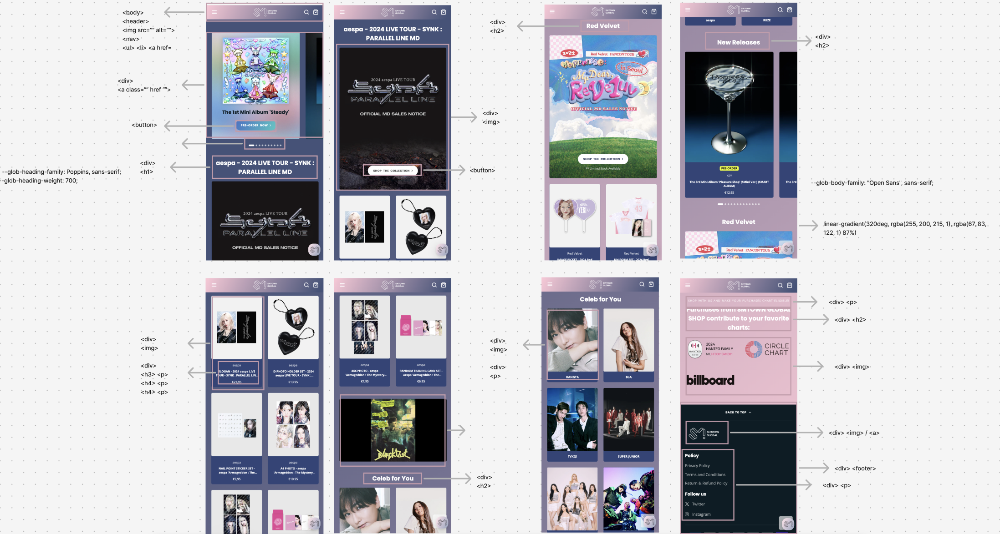

  ### dynamisch deel (bijv menu): 
  

  ### wellicht nog een dynamisch deel (bijv filter): 
  

## Voortgang 1 (week 2)

  
uitwerken voor 1e voortgang

  ### Stand van zaken
  Eerste week verliep erg soepel, het was voornamelijk alleen nog de html erin zetten wat niet heel veel moeite koste, wel moest ik goed na denken wat in articles en divjes kon maar heb er uiteindelijk divs van gemaakt en bij de feedback gevraagd wat ik het best kan doen om zo min mogelijk divs te gebruiken. 

  ### Agenda voor meeting
  samen met je groepje opstellen

| Thomas     | Braham         | Aya    | Joy        |
  | ---            | ---                | ---          | ---              |
  | Hoe maken we vormen? Met vector of images?  | Hoe zit een Carroussel in elkaar?             | Kloppen onze breakdownschetsen?    | Wat is de beste manier om een video te embedden?    |
  | Hoe maak je een progressiebalk bij een carroussel? | Hoe maak je een hamburgermenu met animatie zonder images te gebruiken? | Waar precies moet je div gebruiken en waar een class? | Is onze HTML zo oké & correct? |

  ### Verslag van meeting
  hier na afloop snel de uitkomsten van de meeting vastleggen

carousel → reset - javascript ( hoeft niet infinite ) 

carousel zonder js → articel op css tricks ( animatie is beetje anders, zonder js is ok) 

menu balk ( hamburger menu js ) 

zoveel mogelijk sections & articles 

class → nodig wnr je 2e pagina gaat vormgeven 

aria-label is goed om te gebruiken voor screenreader → mag worden gebruikt

mdn web docs → details 

minimaal 5 surface plane ✈️ 

loop, aria attribuut,

## Voortgang 2 (week 3)

  
uitwerken voor 2e voortgang

  ### Stand van zaken
 Deze week had ik erg veel moeite met opstarten. In deze week begon ik met mijn CSS, dit verliep wel okay, ik vond het moeilijk om een carousel te maken waardoor ik snel vast zat. 

  ### Agenda voor meeting
  samen met je groepje opstellen

| Thomas      | Braham          | Aya    | Joy        |
  | ---            | ---                | ---          | ---              |
  | Hoe zorg ik dat mijn header van kleur verandert, als ik voorbij een bepaald punt op mijn pagina ben?  | Hoe krijg ik de pijl van de details element aan de andere kant van de summary?    | hoe zorg ik dat een deel van de header vast blijven tijdnes het scrollen (position: fixed en sticky niet gewerkt)  | en dan ik dat    |
  | Is het echt verkeerd om dingen te positionen met paddings en margins?            | Moest je nou je hele main een class geven, of per element?              | Mijn elementen schuiven naar rechts toe en ik weet niet waar ik een fout heb staan in de code. Alles staat scheef hellup!!!!          | ...              |

  ### Verslag van meeting
Ik had deze week nog niet veel CSS, maar volgens de studenten assistenten zag het er al wel netjes uit. Daarnaast hebben ze mij een paar tips gegeven over hoe ik het beste een carousel in elkaar kon zetten en ze stuurden en paar linkjes door. 

## Toegankelijkheidstest 2/2 (week 4)

  
uitwerken na test in 9e werkgroep

  ### Bevindingen
  Lijst met je bevindingen die in de test naar voren kwamen (geef ook aan wat er verbeterd is):

   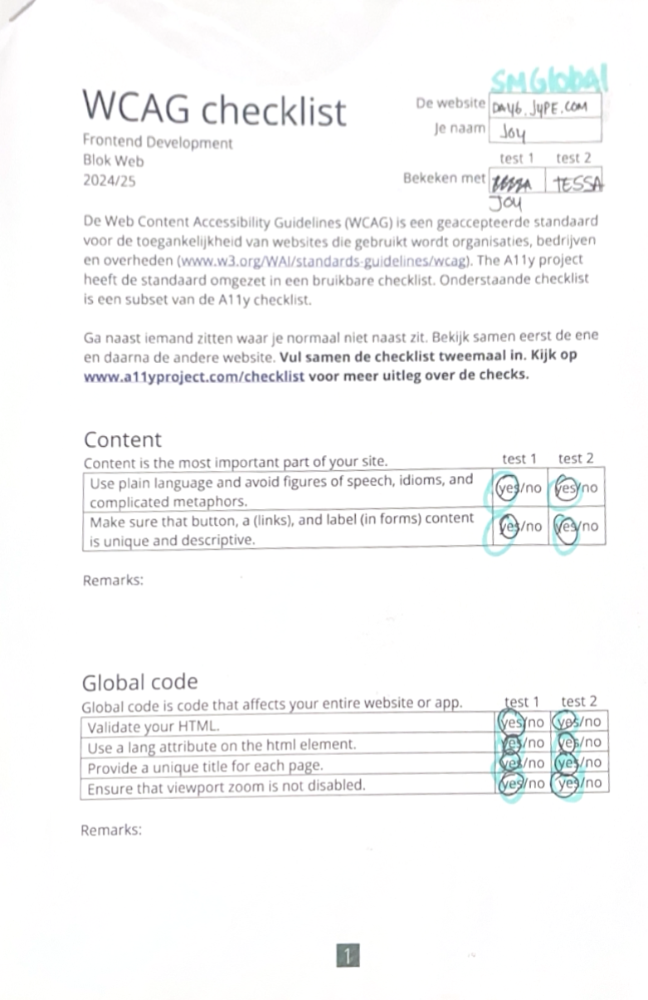
   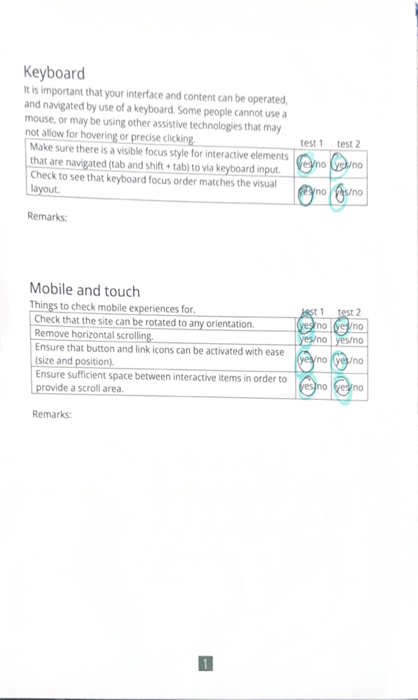
   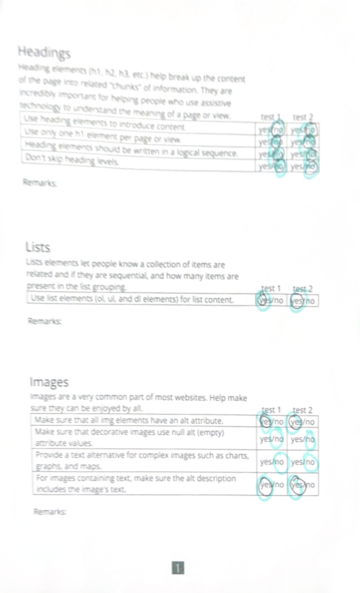
   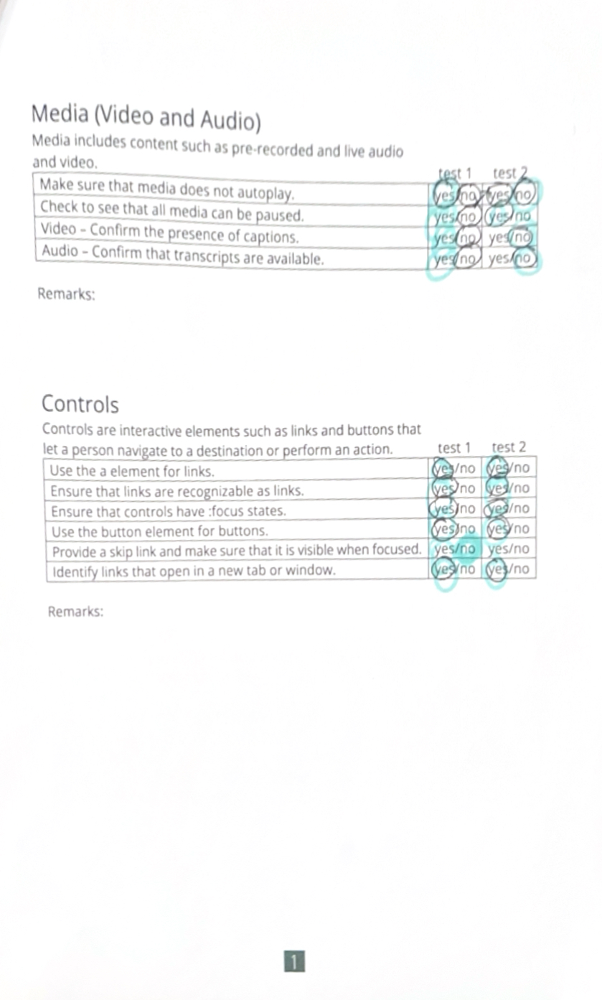
   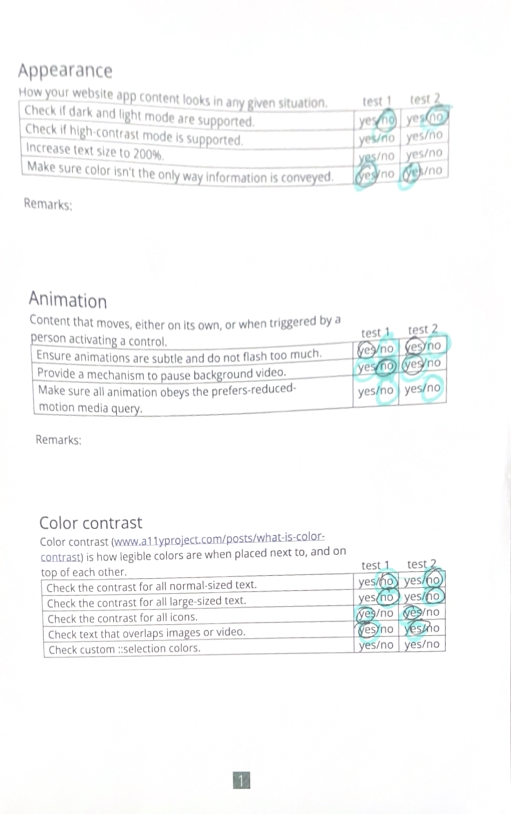

   In deze les hebben we de toegankelijkheidstest gedaan met verschillende materialen om een soort van idee te krijgen hoe mensen met deze handicap ervaren om op het internet te surfen. Zelf heb ik een paar brillen geprobeerd en wat elistiekjes om mijn vingers heen. Ook zijn we door de website heen gegaan en heb ik de accesibility to speach functie gebruikt, dit vond ik nog erg lastig te begrijpen. 

## Voortgang 3 (week 4)

  
uitwerken voor 3e voortgang

  ### Stand van zaken
 In deze week wil ik graag al begin hebben van mijn JS en al een groot deel van mijn CSS af hebben. 

  ### Agenda voor meeting
  samen met je groepje opstellen

| Thomas      | Braham         | Aya   | Joy        |
  | ---            | ---                | ---          | ---              |
  | Hoe kan ik het best die gradients doen van de afbeeldingen?  | Moet de carousel direct overeen komen met hoe de website er daadwerkelijk uitziet?             | en ik dit    | Wat vind je van het plan voor de rest van mijn werk?    |
  | Wat is de beste manier om vormen te maken? Met SVG, of met Border Radius? | Hoe los ik alle problemen met rescalability op? | nog een punt | dit wil ik zeker |
  | ...            | ...                | ...          | ...              |

  ### Verslag van meeting
Deze feedback sessie heb ik helaas niet bij kunnen wonen vanwege ziekte, wel heb ik mijn klasgenoten mijn vragen doorgegeven en hierdoor heb ik nog verder kunnen werken. 

- ik had gevraagd als alle details van de carousel moest worden verwerkt in onze pagina, daarop heb ik de antwoord gekregen dat het wel waard is om er tijd en moeite in te steken maar als het heel ingewikkeld wordt hoeft het geen identieke kopie te zijn. 

## Eindgesprek (week 5)

  
uitwerken voor eindgesprek

  ### Je uitkomst - karakteristiek screenshots:
  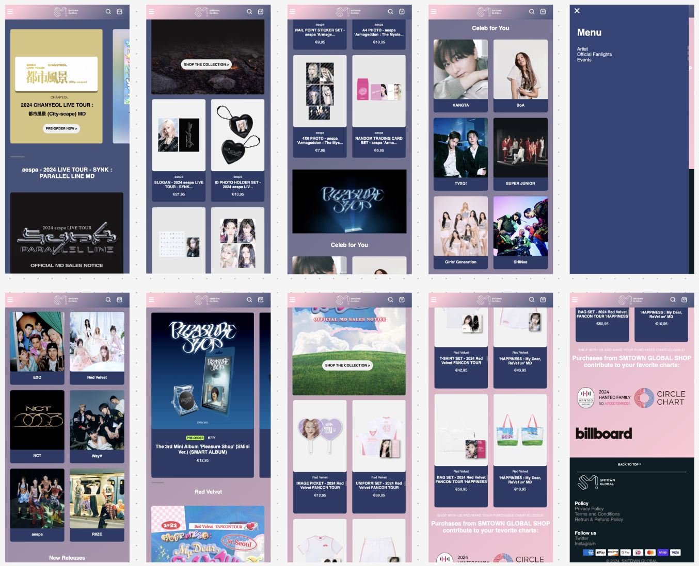

  ### Dit ging goed/Heb ik geleerd: 
  Door de oefeningen dat we tijdens de les hebben gedaan begreep ik beter hoe grid en flex-boxen werkten

  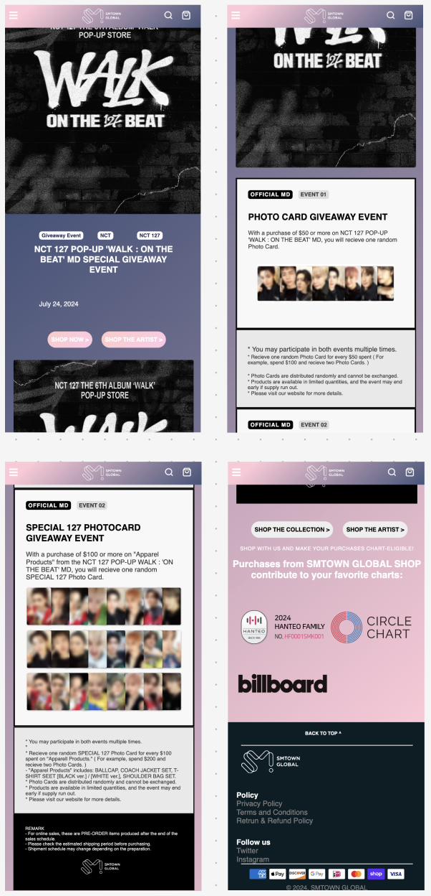

  ### Dit was lastig/Is niet gelukt:
  1. De eerste obstakel dat ik had waren de buttons van de carousel. Ik vond dit erg lastig om na te maken en door tijds nood heb ik dit maar weg gelaten. 
  2. Daarnaast heb ik hulp gevraagd aan een klasgenootje hoe ik een hamburger menu in elkaar kon zetten sinds ik het zelf erg lastig vond. Met een paar tips en chatgpt is het me soort van gelukt, als ik meer tijd had gehad had ik hier meer in willen verdiepen. 
  3. Ik vond het lastig om een video te implimenteren en kon niet zo goed begrijpen hoe ik dat erin moest zetten, na wat rond vragen bij een paar klasgenoten werkte het alsnog niet. 

  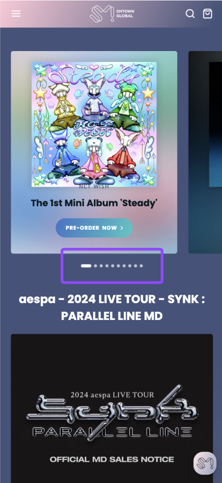
  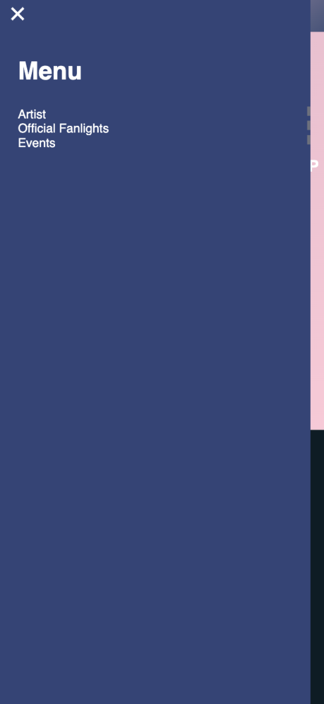
  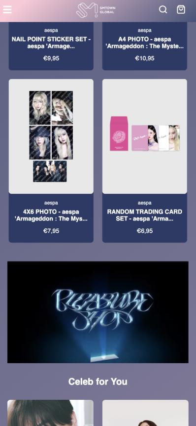

## Bronnenlijst

  
continu bijhouden terwijl je werkt

  Nb. Wees specifiek ('css-tricks' als bron is bijv. niet specifiek genoeg). 
  Nb. ChatGpT en andere AI horen er ook bij.
  Nb. Vermeld de bronnen ook in je code.

https://global.shop.smtown.com/
https://flexboxfroggy.com/
https://cssgridgarden.com/
https://chatgpt.com/ 
https://css-tricks.com/almanac/properties/g/grid-column/
https://css-tricks.com/almanac/properties/g/gap/
https://css-tricks.com/almanac/properties/o/object-fit/ 
https://developer.mozilla.org/en-US/docs/Web/CSS/scroll-snap-type
carousel tips van studentassistenten
https://codepen.io/erikterwan/pen/EVzeRP
https://developer.mozilla.org/en-US/docs/Web/HTML/Element/figure
https://css-tricks.com/how-to-make-an-unobtrusive-scroll-to-top-button
https://assets.codepen.io/274456/ui-icon-cross.svg 
https://assets.codepen.io/274456/ui-icon-hamburger.svg
https://www.youtube.com/watch?v=lAe5m03-vjU
https://developer.mozilla.org/en-US/docs/Web/CSS/@media/prefers-reduced-motion 

